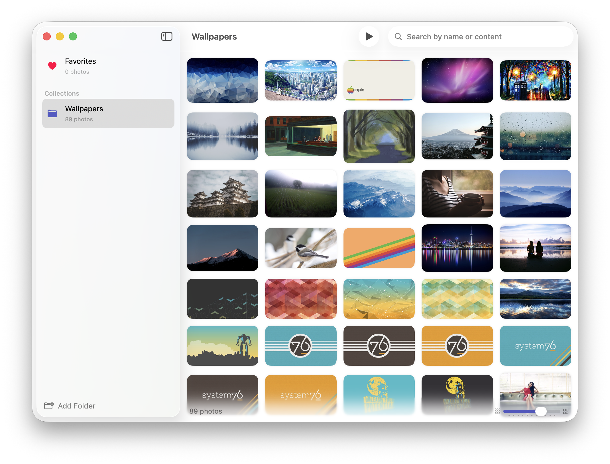

# Shoebox

A native macOS photo browser built with SwiftUI. Add local folders as "collections" and browse, search, and slideshow your photos. A companion desktop widget displays a rotating slideshow from a chosen collection.



## Features

- Browse photos from any local folder
- Organize multiple folders as named collections
- Search photos by filename or content
- Full-screen photo detail view
- Slideshow mode
- macOS desktop widget with smart cropping (face detection + saliency)
- Password-protect individual collections

## Requirements

- macOS 26+
- Xcode 26+

## Building

1. Open `Shoebox.xcodeproj` in Xcode.
2. Set your **Development Team** in the Signing & Capabilities tab for both the `Shoebox` and `ShoeboxWidget` targets.
3. Build and run (Cmd+R).

The app is sandboxed and uses an App Group (`group.net.sub-pop.shoebox`) for sharing data between the main app and the widget. Xcode will provision this automatically when a valid team is configured.

## Project Structure

```
Shoebox/
├── Shoebox/                          # Main app target
│   ├── ShoeboxApp.swift              # App entry point
│   ├── ContentView.swift             # Root view (NavigationSplitView)
│   ├── Info.plist
│   ├── Shoebox.entitlements
│   ├── Models/
│   │   ├── PhotoItem.swift           # Single photo model
│   │   └── PhotoCollection.swift     # Folder collection model (Codable)
│   ├── Views/
│   │   ├── CollectionSettingsView.swift
│   │   ├── EmptyStateView.swift
│   │   ├── FavoriteButton.swift
│   │   ├── GlassCircleButton.swift
│   │   ├── LockedCollectionView.swift
│   │   ├── PhotoDetailView.swift
│   │   ├── PhotoGridView.swift
│   │   ├── ShareButton.swift
│   │   └── SidebarView.swift
│   └── Services/
│       ├── CollectionManager.swift   # Collection CRUD, persistence, widget export
│       ├── FavoritesManager.swift    # Per-collection photo favorites
│       ├── FolderWatcher.swift       # DispatchSource folder-change monitor
│       ├── ImageIndexer.swift        # On-device image content indexing
│       ├── PhotoLoader.swift         # Async folder scanning
│       ├── SmartCropper.swift        # Vision-based face/saliency focus point
│       ├── ThumbnailCache.swift      # In-memory NSCache-backed thumbnail actor
│       └── ThumbnailGenerator.swift  # Thumbnail creation for widget export
├── Shared/
│   └── ShoeboxKit.swift              # Constants & utilities shared between app and widget
├── ShoeboxWidget/                    # WidgetKit extension target
│   ├── ShoeboxWidget.swift
│   ├── ShoeboxWidgetBundle.swift
│   ├── CollectionAppEntity.swift     # AppEntity for widget configuration
│   ├── SelectCollectionIntent.swift  # App intent for collection picker
│   ├── ShoeboxWidget.entitlements
│   └── Info.plist
└── Shoebox.xcodeproj/
```

## How It Works

- **Collections** are persisted as JSON in shared `UserDefaults` (via App Group). Each collection stores a security-scoped bookmark for sandbox-safe folder access. The App Group identifier is read from `Info.plist`, derived from the Xcode `DEVELOPMENT_TEAM` build setting.
- **Favorites** are tracked by photo ID in shared `UserDefaults`. `FavoritesManager` supports toggling, bulk removal by directory, and pruning stale entries.
- **FolderWatcher** monitors collection directories for changes using FSEvents and debounces rapid filesystem events before triggering a reload.
- **ImageIndexer** runs Vision classification, text recognition, and feature-print extraction on each photo. Results are cached to disk as JSON per collection. The index powers keyword search (tags and OCR text) and visual-similarity search (feature-print distance).
- **ThumbnailCache** is a Swift actor backed by `NSCache` (500 items / 150 MB limit) with a SHA256-keyed JPEG disk cache. Cached thumbnails are automatically invalidated when the source file's modification date is newer.
- **ThumbnailGenerator** uses ImageIO (`CGImageSource`) for efficient, EXIF-orientation-aware thumbnail creation. It is used by both `ThumbnailCache` and widget export.
- **Widget export** writes up to 48 JPEG thumbnails to the shared App Group container along with a `focus_points.json` manifest. The widget reads these at timeline refresh.
- **SmartCropper** uses the Vision framework for face detection with an attention-based saliency fallback to compute a focus point for smart cropping in the widget.
